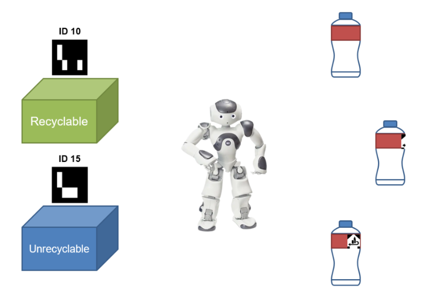

# NAO_Collect_Bottles

Let the NAO robot collect bottles with recyclable symbol.
Demo: [link](https://youtu.be/Z2xT2zG202E)



# Dependencies
OpenCV and Aruco

Install openCV:
```
sudo apt-get install python3-opencv
``````

How to install aruco:
1. Enter the ArUco official website and download the latest version for ArUco. Then decompress the downloaded file.
2. In the terminal, make sure within the ArUco directory and run the following commands:
    ```
    mkdir build
    cd build
    cmake ..
    make
    sudo make install
    ```

# Launch
run the follow commands in different terminal:
```
roslaunch nao_bringup nao_full_py.launch

roslaunch nao_apps speech.launch 

roslaunch nao_apps tactile.launch 

roslaunch nao_control nao.launch

rosrun nao_control project
```
